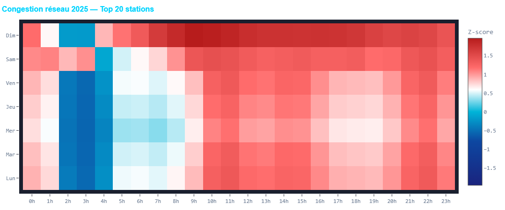
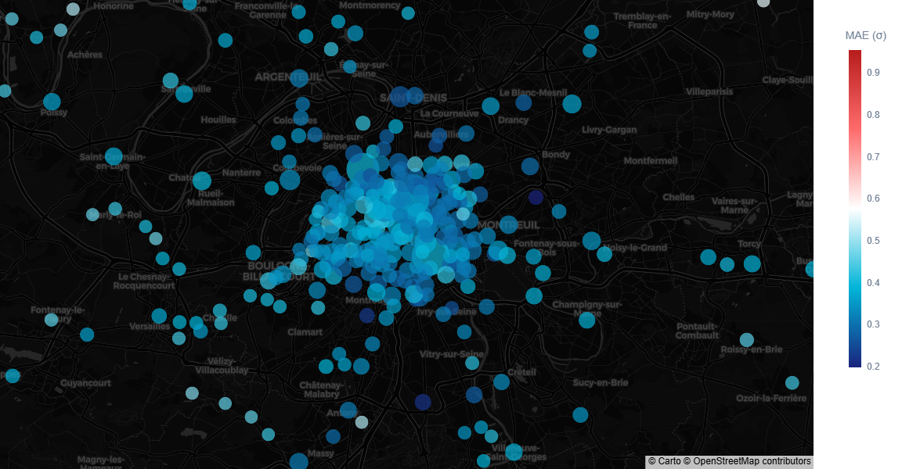
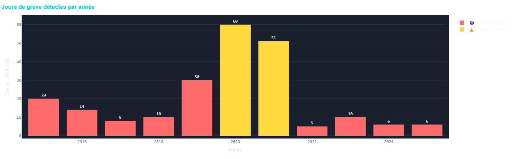
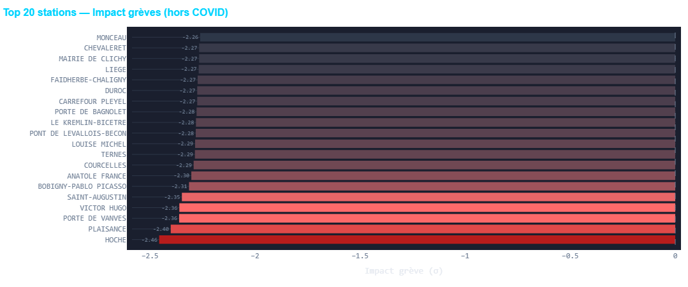
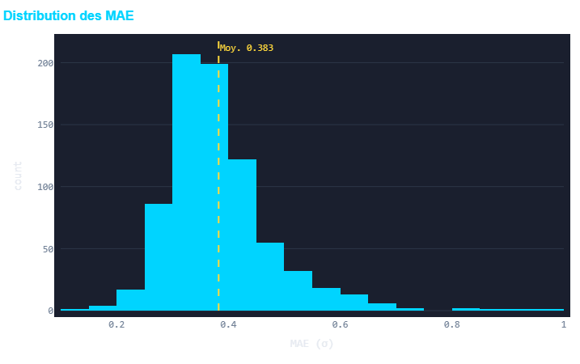
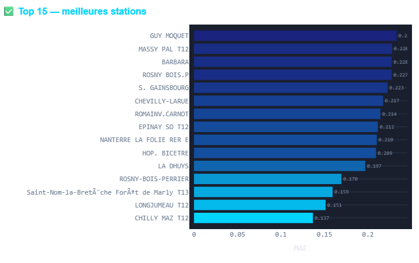
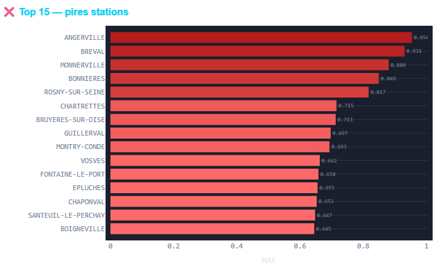
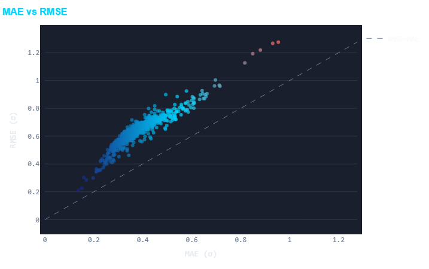

# 🚇 MetroSignal

> Prédiction du taux de congestion (z-score) IDFM par station et par heure. Pipeline Data Engineering → Machine Learning → API REST → Dashboard interactif


---

## Table des matières

- [Aperçu](#aperçu)
- [Architecture](#architecture)
- [Résultats de l'EDA](/outputs/eda/eda.md)
- [Résultats du modèle](#résultats-du-modèle)
- [Stack technique](#stack-technique)
- [Structure du projet](#structure-du-projet)
- [Installation et lancement](#installation-et-lancement)
- [Pipeline CLI](#pipeline-cli)
- [Dashboard](#dashboard)
- [API REST](#api-rest)
- [Sources de données](#sources-de-données)
- [Limitations connues](#limitations-connues)

---

## Aperçu

MetroSignal est un projet portfolio de bout en bout couvrant les trois axes d'un profil data :

| Axe | Ce que fait le projet |
|---|---|
| **Data Engineering** | Ingestion de 3 sources hétérogènes, nettoyage, reconstruction horaire, warehouse DuckDB, orchestration via CLI |
| **Data Science** | Feature engineering temporel, modèle LightGBM, évaluation par station, SHAP values |
| **Data Visualization** | Dashboard Streamlit 7 vues, API FastAPI, carte géographique interactive |

**Dataset** : 66 millions de lignes couvrant ~730 stations IDFM sur la période **2015–2025**, enrichies avec la météo horaire (Open-Meteo) et les événements culturels parisiens (OpenAgenda).

**Métrique cible** : taux de congestion exprimé en **z-score** par créneau (station, jour de la semaine, heure) — directement interprétable et comparable entre toutes les stations quelle que soit leur taille.

---

## Aperçu du dashboard











Les 7 vues disponibles :

| Vue | Description |
|---|---|
| 🗺️ Heatmap réseau | Congestion moyenne par heure × jour de la semaine, top N stations par rapport à la moyenne des z-scores entre 2015-2024|
| 🌧️ Météo & Trafic | Corrélation précipitations / température / vent → congestion |
| 🎭 Événements & Pics | Timeline congestion superposée aux événements culturels parisiens |
| 🔮 Prédiction ML | Interface temps réel vers l'API FastAPI avec jauge visuelle |
| 🌍 Carte géographique | ~730 stations géolocalisées, colorées par MAE / volume |
| 🚨 Grèves & Anomalies | 352 jours détectés, profil horaire grève vs normal, zoom COVID 2020 |
| 📈 Performance modèle | Distribution MAE, top/flop stations |

---

## Architecture

```
┌─────────────────────────────────────────────────────────────┐
│                        Sources brutes                        │
│   IDFM (CSV)        Open-Meteo (API)     OpenAgenda (API)   │
└──────────┬───────────────┬──────────────────┬───────────────┘
           │               │                  │
           ▼               ▼                  ▼
┌─────────────────────────────────────────────────────────────┐
│                     CLI unifié (flow.py)                     │
│  ingest_idfm.py   ingest_weather.py   ingest_events.py      │
│                     transform.py                             │
└──────────────────────────┬──────────────────────────────────┘
                           │
                           ▼
┌─────────────────────────────────────────────────────────────┐
│                    DuckDB  warehouse.duckdb                  │
│  validations   weather   events   dataset_enrichi            │
│                      (66M lignes)                            │
└──────────┬────────────────────────────────┬─────────────────┘
           │                                │
           ▼                                ▼
┌────────────────────┐           ┌──────────────────────────┐
│    ml/ LightGBM    │           │   dashboard/ Streamlit   │
│  train.py          │           │       app.py (7 vues)    │
└────────┬───────────┘           └──────────────────────────┘
         │
         ▼
┌────────────────────┐
│  API FastAPI       │
│  GET /predict      │
│  GET /stations     │
│  GET /history/{s}  │
└────────────────────┘
```

---

## Résultats du modèle

Modèle : **LightGBM** — 200 itérations, `learning_rate=0.05`, `num_leaves=127`

Split temporel strict : **train 2015–2023** → **test 2024–2025** (pas de fuite temporelle)

| Métrique | Valeur globale |
|---|---|
| MAE | **0.383 σ** |
| RMSE | **0.637 σ** |

Rappel d'interprétation : la cible est un z-score sur [-5, 5]. Une MAE de 0.38 signifie que le modèle se trompe en moyenne de moins de 0.4 écart-type, soit une erreur inférieure à ce que représente passer de "trafic normal" à "légèrement chargé".

**Dispersion par station**

| | Station | MAE |
|---|---|---|
| ✅ Meilleures | CHILLY-MAZARIN, LONGJUMEAU | ~0.14 σ |
| ❌ Pires | ANGERVILLE, BREVAL (Transilien gr. couronne) | ~0.95 σ |

**Features les plus importantes** (SHAP Châtelet, vendredi 17h)

1. `lag_1h` : le trafic à l'heure précédente
2. `lag_24h` : même créneau la veille
3. `is_vacances_scolaires` : impact négatif fort
4. `heure_sin` / `heure_cos` : encodage cyclique de l'heure
5. `lag_7j` : même créneau 7 jours avant

---

## Stack technique

| Catégorie | Outil |
|---|---|
| Langage | Python 3.11 |
| Warehouse | DuckDB |
| Machine Learning | LightGBM, scikit-learn |
| Interprétabilité | SHAP |
| API | FastAPI + Uvicorn |
| Dashboard | Streamlit + Plotly |
| Calendrier | `holidays` (jours fériés FR) |
| Données météo | Open-Meteo Archive API |
| Données événements | OpenAgenda API |
| Données trafic | IDFM open data (data.iledefrance-mobilites.fr) |

---

## Structure du projet

```
MetroSignal/
├── pipeline/
│   ├── ingest_idfm.py        # Ingestion CSV IDFM (NB_FER + PROFIL_FER)
│   ├── ingest_weather.py     # API Open-Meteo — données horaires 2015-2025
│   ├── ingest_events.py      # API OpenAgenda — ~45 500 événements parisiens
│   └── transform.py          # Z-score, features calendrier, jointures, grèves
├── ml/
│   └── train.py              # LightGBM, feature engineering, lags, évaluation, SHAP
├── dashboard/
│   └── app.py                # Streamlit — 7 vues
├── data/
│   ├── raw/                  # CSV IDFM bruts (non versionnés)
│   └── warehouse.duckdb      # Base DuckDB (non versionnée)
├── outputs/
│   ├── img/eda/              # Figures EDA (PNG)
│   ├── eda/eda_report.html   # Rapport EDA interactif
│   └── ml/models/            # Modèle sérialisé, métriques par station, SHAP values
├── outputs/
│   ├── eda.py                # Analyse exploratoire → rapport HTML
├── flow.py                   # CLI unifié (idfm / weather / events / transform / train / evaluate / serve / inspect / all)
├── .env                      # Variables d'environnement (non versionné)
├── .gitignore
├── requirements.txt
└── README.md
```

---

## Installation et lancement

### Prérequis

- Python 3.11+
- ~6 GB d'espace disque pour les CSV IDFM bruts
- Clé API OpenAgenda gratuite (compte à créer sur openagenda.com)

### Installation

```bash
git clone https://github.com/ton-username/MetroSignal.git
cd MetroSignal

python -m venv .venv
source .venv/bin/activate       # Linux/macOS
# .venv\Scripts\activate        # Windows

pip install -r requirements.txt
```

### Variables d'environnement

Crée un fichier `.env` à la racine :

```env
OPENAGENDA_PUBLIC_KEY=ta_cle_api
```

### Téléchargement des données IDFM

Télécharge les fichiers de validations et profils horaires sur
[data.iledefrance-mobilites.fr](https://data.iledefrance-mobilites.fr)
et place-les dans `data/raw/` en respectant la structure `data-rf-YYYY/`.

---

## Pipeline CLI

Toutes les commandes passent par `flow.py` :

```bash
# Pipeline complet (ordre automatique)
python flow.py all

# Étapes individuelles
python flow.py idfm       # Ingestion validations IDFM (toutes années)
python flow.py weather    # Ingestion météo horaire Open-Meteo
python flow.py events     # Ingestion événements OpenAgenda
python flow.py transform  # Feature engineering + construction dataset_enrichi

# Analyse exploratoire
python eda.py             # Génère outputs/eda/eda_report.html

# Machine Learning
python flow.py train      # Entraînement LightGBM
python flow.py evaluate   # Évaluation → outputs/ml/models/station_metrics.csv

# Inspection de la BDD
python flow.py inspect    # Schéma + stats + échantillon aléatoire par table

# API
python flow.py serve      # Lance FastAPI sur localhost:8000
```

---

## Dashboard

```bash
streamlit run dashboard/app.py
```

Accessible sur `http://localhost:8501`.

Pour pointer vers une BDD ou un CSV géo différents :

```bash
DB_PATH=data/warehouse.duckdb \
GEO_CSV_PATH=data/raw/arrets-idfm-geo.csv \
streamlit run dashboard/app.py
```

---

## API REST

```bash
python flow.py serve
# → http://localhost:8000
# → Documentation Swagger : http://localhost:8000/docs
```

### Endpoints

```
GET /predict?station=CHATELET&datetime=2025-06-13T08:00:00
    → { "taux_congestion_predit": 1.84, "station": "CHATELET", ... }

GET /stations
    → liste des ~730 stations triées par volume décroissant

GET /history/{station}?start=2024-01-01&end=2024-01-31
    → historique DuckDB sur la période demandée
```

---

## Sources de données

| Source | Couverture | Licence |
|---|---|---|
| [IDFM open data](https://data.iledefrance-mobilites.fr) | Validations journalières par station 2015–2025 | Licence Ouverte Etalab |
| [Open-Meteo](https://open-meteo.com) | Météo horaire Paris 2015–2025 | CC BY 4.0 |
| [OpenAgenda](https://openagenda.com) | ~45 500 événements culturels parisiens 2015–2025 | API publique gratuite |
| [IDFM géo](https://data.iledefrance-mobilites.fr) | Coordonnées GPS des arrêts | Licence Ouverte Etalab |

---

## Limitations connues

Ces limitations sont documentées volontairement.

**Reconstruction horaire approximative**
Les fichiers IDFM ne fournissent que des totaux journaliers. La granularité horaire est reconstruite en multipliant le total par un profil de distribution (`PROFIL_FER`) selon le type de jour. C'est une estimation — le profil horaire réel peut varier selon les événements de la journée.

**Détection de grèves — faux négatifs COVID**
Le flag `is_greve` repose sur un seuil de baisse généralisée du z-score (≥50% des stations sous -1.55σ). En pratique, le signal COVID 2020 ne déclenche quasiment pas ce flag : sur les 60 jours `is_greve=1` détectés en 2020, 59 se situent hors des périodes de confinement. Les confinements produisent une baisse très profonde et très uniforme du trafic, ce qui fait chuter la baseline de référence et comprime les z-scores — le seuil relatif n'est donc pas franchi. Un flag `is_covid` dédié (déjà présent dans `dataset_enrichi`) permet de distinguer les deux phénomènes.

**Noms de stations**
La jointure entre les fichiers IDFM (noms en majuscules, parfois abrégés) et le CSV géographique repose sur une normalisation textuelle. Un pourcentage de stations (~5-10%) peut ne pas être géolocalisé automatiquement en raison de divergences de nommage persistantes entre les sources.

**La Défense — volume surestimé**
La station `LA DEFENSE-GRANDE ARCHE` agrège plusieurs `code_arret` correspondant à des lignes distinctes (RER A, Métro 1, Transilien L). Son volume total est artificiellement élevé par rapport aux stations mono-ligne et doit être interprété avec précaution dans les classements.

**Pic de validations fin 2024**
Un spike anormal (~10–14M validations/jour vs ~6–8M habituellement) est visible sur les données 2024. L'hypothèse la plus probable est un changement de périmètre dans les fichiers IDFM (intégration de nouvelles lignes ou d'un nouveau réseau). Ce point n'a pas été entièrement résolu et peut biaiser les métriques sur la période de test.

**Modèle global vs modèles par station**
Un unique modèle LightGBM est entraîné sur toutes les stations. Les pires performances (MAE ~0.95) concernent des stations de grande couronne Transilien à flux très irrégulier. Des modèles individuels par station ou par groupe de stations amélioreraient probablement les résultats sur ces cas difficiles.

---

## Licence

MIT — voir [LICENSE](LICENSE)