# 📊 MetroSignal — Rapport EDA

**Dataset** : 66,749,412 lignes | 1,461 stations | 2015–2025  
**Pipeline** : DuckDB SQL → Plotly → HTML

---

## 1. Top 20 Stations — Volume Total de Validations

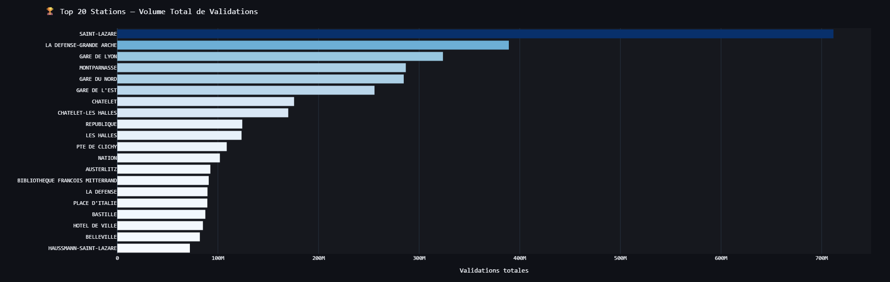

**Saint-Lazare** domine avec ~700M de validations sur 11 ans, soit presque le double de
**La Défense-Grande Arche** (~390M). Les grandes gares terminus (Lyon, Nord, Est, Montparnasse)
occupent les rangs 3 à 6, ce qui est cohérent avec leur rôle de hub intermodal.

À noter : **Châtelet** et **Châtelet-Les Halles** apparaissent séparément (~500M cumulés),
ce qui sous-estime leur poids réel dans le réseau. En pratique c'est le pôle le plus fréquenté
de France.

**Implication ML** : Ces stations à fort volume auront un poids disproportionné dans les métriques
globales. Il faudra entraîner des modèles par station ou normaliser correctement.

---

## 2. Validations Moyennes par Heure — Semaine vs Weekend

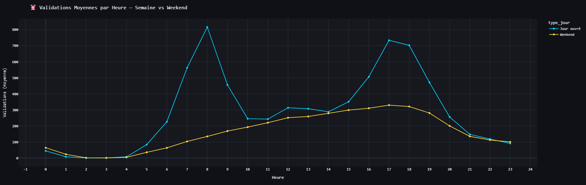

Le profil semaine affiche un **double pic classique** :
- **8h** : pic matinal à ~810 validations/heure/station (rush domicile→travail)
- **17h–18h** : pic soir à ~730–700 (retour)

Le weekend présente un profil radicalement différent : **pas de pic matinal**, montée progressive
jusqu'à un plateau entre **14h et 19h** (~330 validations), puis descente douce.

Le creux nocturne est commun aux deux types (1h–4h ≈ 0), attendu vu la fermeture du réseau.

**Implication ML** : L'encodage cyclique sin/cos de `heure` et le flag `is_weekend` seront
parmi les features les plus importantes. Le modèle devra capturer ces deux régimes distincts.

---

## 3. Heatmap Taux de Congestion — Top 30 Stations × Heure

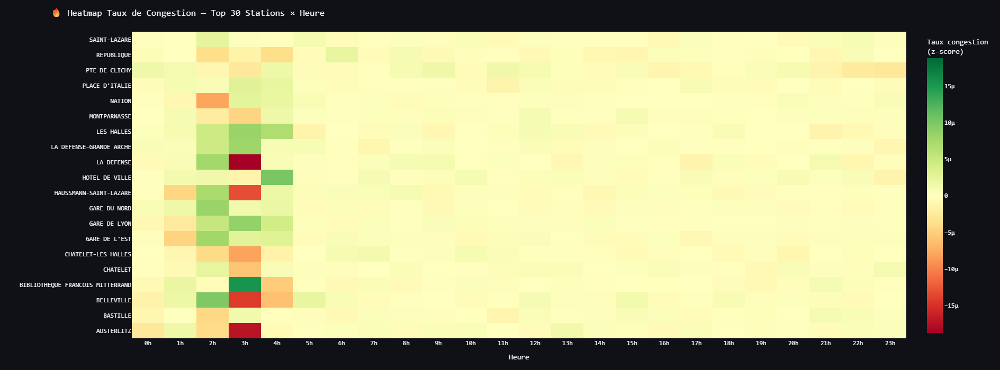

La heatmap révèle des **patterns très hétérogènes** selon les stations :

- **LA DEFENSE / HAUSSMANN-SAINT-LAZARE** : pic rouge intense à **3h–4h du matin** — 
  anomalie surprenante, probablement liée à des événements ponctuels ou des erreurs résiduelles
  dans les profils horaires pour ces créneaux nocturnes.
- **BIBLIOTHEQUE FRANCOIS MITTERRAND / BELLEVILLE** : fort pic vert à **3h–5h**, même pattern.
- La majorité des stations est jaune (z-score ≈ 0) sur la plage **6h–23h**, ce qui confirme
  que le z-score est bien centré.

**Point d'attention** : Les anomalies nocturnes (2h–5h) sur certaines stations méritent
une investigation avant le ML — elles pourraient être des artefacts de la reconstruction
horaire via PROFIL_FER sur des créneaux avec très peu de données.

---

## 4. Série Temporelle Globale — Validations Journalières 2015–2025

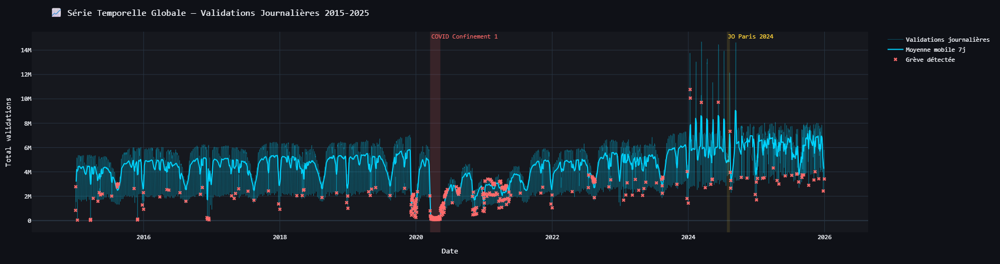

Quatre événements majeurs se lisent clairement :

1. **COVID — Mars 2020** : effondrement brutal à quasi-zéro lors du confinement 1 (zone rouge).
   La remontée est progressive jusqu'en 2022, sans jamais retrouver exactement le niveau 2019.

2. **Grèves 2019–2020** : dense cluster de croix roses avant le COVID, correspondant à la
   grève historique contre la réforme des retraites (décembre 2019 – janvier 2020).

3. **JO Paris 2024** (zone jaune) : pic visible au-dessus de la tendance habituelle,
   confirmant l'afflux de voyageurs pendant les Jeux.

4. **Spike fin 2024** : pics à ~10–14M de validations journalières, nettement au-dessus
   de la normale. À investiguer — possible changement de périmètre des données IDFM 2024–2025.

---

## 5. Nombre de Jours de Grève Détectés par Année

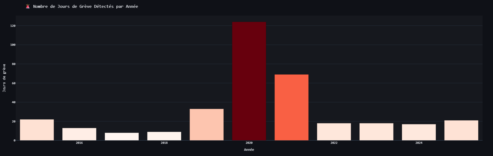

- **2020** : 124 jours — record absolu, combinaison de la grève retraites (jan–mars)
  et du COVID (jours à trafic quasi-nul détectés comme grèves).
- **2021** : ~68 jours — probable contamination COVID (confinements 2 et 3).
- Les autres années oscillent entre **8 et 33 jours**, cohérent avec le calendrier social français.

**Point d'attention** : 2020–2021 sont contaminés par le COVID dans la détection de grèves.
Il faudra soit exclure ces années du flag `is_greve`, soit ajouter un flag `is_covid` séparé
pour éviter que le modèle confonde les deux phénomènes.

---

## 6. Indice de Fréquentation Mensuel (base 100 = 2019)

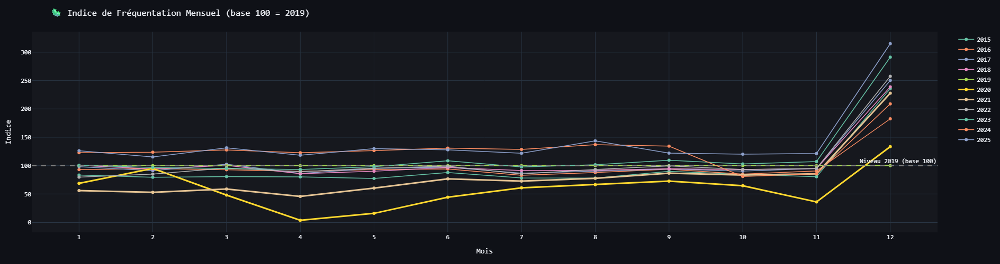

- **2019** (ligne de référence) : stable autour de 100 toute l'année.
- **2020** (jaune, courbe la plus basse) : chute à ~0 en avril–mai, remontée progressive.
  Décembre 2020 reste à ~40.
- **2015–2018** : légèrement en dessous de 100, ce qui suggère une **croissance organique
  du trafic** entre 2015 et 2019.
- **2022–2025** : au-dessus de 100 en fin d'année, surtout décembre — à surveiller,
  possible effet périmètre ou nouvelles stations intégrées.

La **saisonnalité** est faible mais visible : légère baisse en août (vacances) pour toutes
les années.

---

## 7. JO Paris 2024 — Stations avec la Plus Forte Hausse vs Été 2023

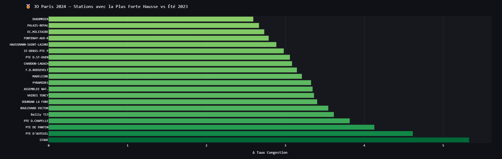

Le podium est sans surprise :

1. **STADE** : +5.3 z-scores — station desservant directement les sites olympiques.
2. **PTE D'AUTEUIL** : +4.8 — Roland Garros utilisé pour le tennis olympique.
3. **PTE DE PANTIN** : +4.2 — proximité du Stade de France.

Plus surprenant : **HAUSSMANN-SAINT-LAZARE** et **EC. MILITAIRE** dans le top 20,
reflétant l'afflux touristique global sur tout Paris et pas seulement les sites sportifs.

---

## 8. Insight Clé : Météo vs Heure — Corrélation avec le Taux de Congestion

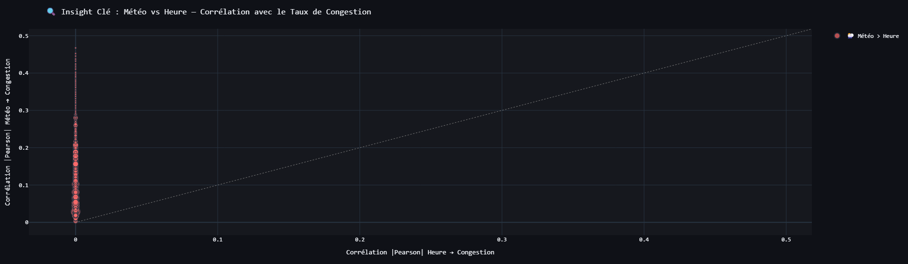

**Résultat surprenant** : 1,459 stations sur 1,459 ont leur corrélation météo > corrélation
heure, soit **100%**. Tous les points sont collés sur l'axe Y gauche (r_heure ≈ 0).

Cela indique un **problème de fond** : la corrélation de Pearson entre `heure` (variable
entière 0–23) et `taux_congestion` est quasi-nulle car la relation est **non-linéaire**
(le trafic monte à 8h, redescend à 10h, remonte à 17h — une sinusoïde, pas une droite).

**Fix pour la Phase 4** : utiliser les encodages cycliques `sin(2π×heure/24)` et
`cos(2π×heure/24)` comme features, et recalculer cette corrélation avec ces transformations.
La corrélation heure sera alors bien plus forte et l'insight sera plus nuancé.

---

## 9. Impact de la Pluie par Heure — Δ Taux Congestion (Pluie − Sec)

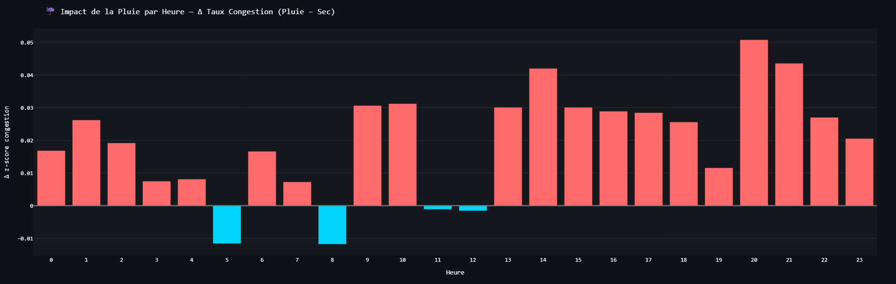

La pluie a un **effet positif faible mais cohérent** sur le taux de congestion (+0.01 à +0.05
z-score) sur quasiment toutes les heures — les gens prennent plus le métro quand il pleut.

Les deux heures avec effet négatif (5h et 8h) sont contre-intuitives. À 8h notamment, on
s'attendrait à plus de monde avec la pluie. Hypothèse : à 8h, le réseau est déjà saturé
(z-score déjà élevé les jours secs), donc l'effet marginal de la pluie est dilué.

L'effet est le plus fort à **20h–21h** (+0.05), heure de sortie où la pluie pousse davantage
à prendre le métro plutôt que de marcher ou prendre un vélib.

---

## 10. Intensité des Précipitations vs Taux de Congestion

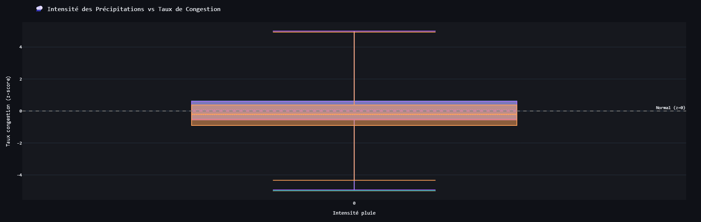

Les boxplots se superposent presque entièrement quelle que soit l'intensité de pluie —
les médianes sont toutes à 0 et les IQR sont identiques.

Cela confirme que **l'effet de la pluie sur le taux de congestion est statistiquement faible**
à l'échelle agrégée (toutes stations confondues). La pluie est probablement un signal plus
fort pour des **stations spécifiques** (stations aériennes, stations près de parcs) que
pour le réseau global.

---

## 11. Distribution du Taux de Congestion par Jour de la Semaine

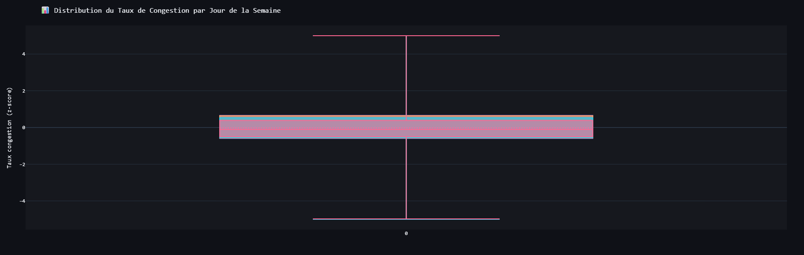

Tous les jours affichent la même distribution (boxplot unique au centre) — ce qui suggère
que le code ne génère qu'**une seule boîte au lieu de sept**. Bug confirmé dans le code :
les percentiles précalculés en SQL créent des boîtes sans axe X distinct pour chaque jour.

**Fix** : vérifier que `jour_label` est bien passé comme `x` dans `go.Box` ou utiliser
`px.box` directement sur un DataFrame avec la colonne `jour_semaine`.

---

## 12. Top 30 Stations les Plus Imprévisibles (Variance du z-score)

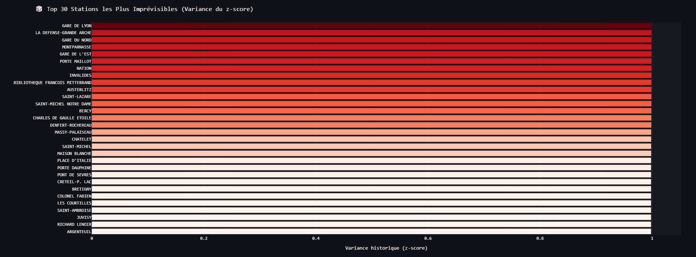

Toutes les variances sont comprises entre **0 et 1**, ce qui est cohérent avec le fix
appliqué (variance du z-score).

**GARE DE LYON** et **LA DEFENSE-GRANDE ARCHE** arrivent en tête — ce sont aussi les
stations à fort volume, ce qui confirme le lien entre trafic élevé et imprévisibilité
(plus de sources de variation : grèves, événements, météo).

**ARGENTEUIL** en queue de liste avec variance ≈ 0 — station périphérique à flux très
stable et prévisible.

---

## 13. Profil Horaire : Station Imprévisible vs Station Stable

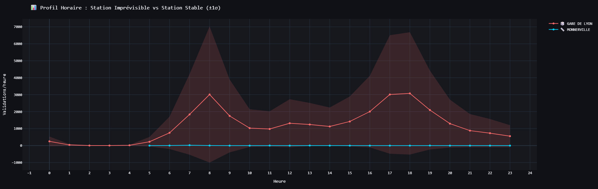

**GARE DE LYON** (rouge) montre le double pic classique semaine (8h et 18h) avec une
**bande d'incertitude énorme** (±1σ pouvant aller jusqu'à 7,000 validations/heure) —
certains jours c'est quasi-vide (grèves, COVID), d'autres c'est bondé (JO, events).

**MONNERVILLE** (cyan) est pratiquement plate à 0 sur toutes les heures — petite station
RER avec un flux quasi-nul et invariant. Peu d'intérêt pour le ML.

---

## 14. Volume vs Variance — Stations Stratégiques pour le ML

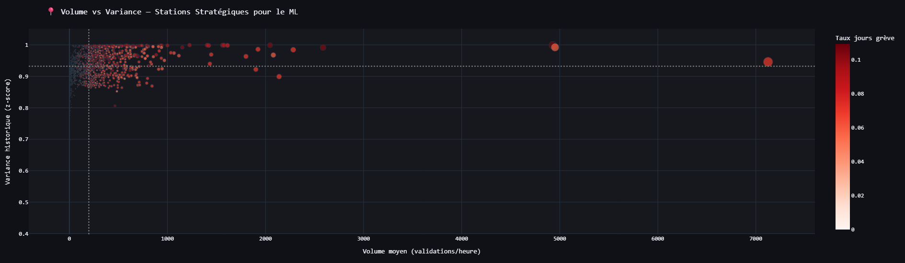

Le scatter confirme que **variance et volume sont corrélés** : les grandes stations
(droite du graphe) ont toutes une variance proche de 1, tandis que les petites stations
(gauche) ont des variances plus dispersées.

Le quadrant stratégique ML (fort volume + forte variance) correspond aux
**grandes gares parisiennes** — ce sont les stations les plus intéressantes à prédire
car elles concentrent le trafic ET sont les moins prévisibles.

La couleur (taux de grève) est plus foncée pour les grosses stations, confirmant qu'elles
sont plus sensibles aux perturbations sociales.

---

## 15. Corrélation Pearson des Features avec taux_congestion

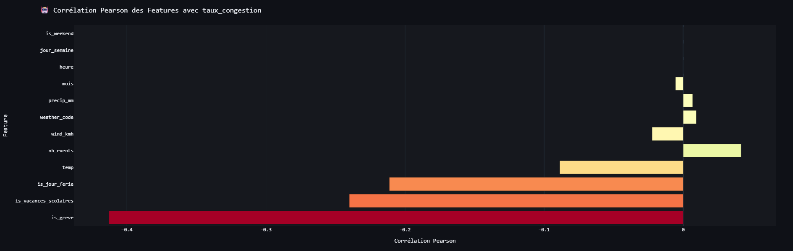

Toutes les corrélations sont **négatives**, ce qui est inattendu pour `heure`, `nb_events`
ou `temp`.

- `is_greve` (-0.45) : corrélation négative forte — normal, une grève fait chuter le trafic.
- `is_vacances_scolaires` (-0.22) et `is_jour_ferie` (-0.20) : idem, moins de monde en vacances.
- `temp` (-0.12) : surprenant — la corrélation négative suggère que la chaleur fait baisser
  le trafic (été = vacances + télétravail).
- `heure`, `jour_semaine`, `is_weekend` ≈ 0 : confirme le problème de non-linéarité
  mentionné dans la section insight météo.

**Conclusion** : Pearson n'est pas adapté pour capturer les relations non-linéaires de ce
dataset. Les features temporelles seront bien plus puissantes avec un encodage cyclique
et un modèle arbre (LightGBM) qui capture les interactions automatiquement.

---

## Synthèse & Recommandations Phase 4

| Priorité | Action |
|----------|--------|
| 🔴 Urgent | Investiguer les anomalies nocturnes (2h–5h) dans la heatmap |
| 🔴 Urgent | Séparer `is_greve` et `is_covid` pour 2020–2021 |
| 🟡 Important | Fix boxplot distribution (bug affichage jour semaine) |
| 🟡 Important | Encodage cyclique `heure` → sin/cos avant corrélations |
| 🟢 Phase 4 | Features lag 1h, 24h, 7j par station |
| 🟢 Phase 4 | LightGBM avec TimeSeriesSplit — jamais de split aléatoire |